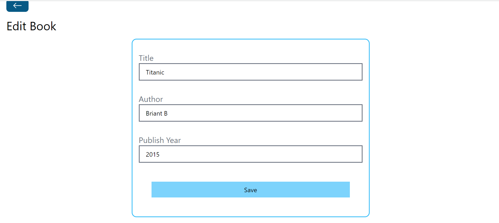

# MOD3-Project

**Book Store Application**

[a link to the live site](https://mod3-project-ayzi.onrender.com)

## Overview

This web application allows users to create, read, update and delete data in the collection. It has a table and card view mode with additional functionality. Easy way to organize and manage your books online.

## Tech/framework used

MERN stack (MongoDB, Express, React, Node.js), React-Router-dom, Tailwind CSS.

## Getting Started

1. Clone this repository to your local machine:

git clone https://github.com/LanaSvet11/module_3_project

2. Open the Visual Studio Code to launch the application.

## Contributing

Contributions are welcome! If you find any issues or have suggestions for improvements, please open an issue or create a pull request.

## License

This project is licensed under the MIT License. See the [LICENSE file](./MIT%20License.txt) for details.

## Contact

If you have any questions or suggestions, please feel free to contact us:

Email: holovatenko.dev@gmail.com
LinkedIn: https://www.linkedin.com/in/svitlana-holovatenko/
